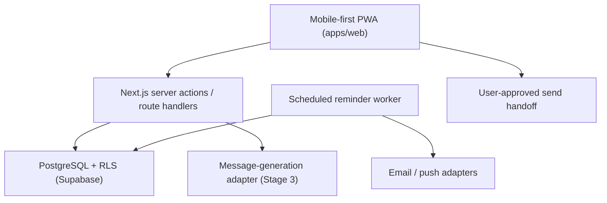

# Noyala — Architecture

## Repository shape

Workspace-based TypeScript monorepo, managed with `pnpm` workspaces.

```
Noyala_Remember/
├─ apps/
│  └─ web/                 Next.js App Router app (web + installable PWA)
├─ packages/
│  ├─ brand/                Brand config + design tokens (single source of truth)
│  └─ domain/                Shared domain types, validation schemas, pure logic
├─ supabase/
│  └─ migrations/           SQL migrations (schema + RLS), applied via Supabase CLI
├─ docs/                     Living documents (this file, product.md, roadmap.md, ...)
└─ .github/workflows/        CI
```

Future phases add `apps/mobile` (Expo/React Native) and additional
`packages/*` (e.g. `packages/provider-contracts`) without restructuring what
already exists — see `docs/roadmap.md`.

## Boundaries

- **`apps/web`** owns routing, UI composition and Next.js server
  actions/route handlers. It depends on `@noyala/domain` and
  `@noyala/brand`. It must not embed business rules that belong in
  `domain` (date recurrence, reminder-window math, RLS-equivalent
  authorization checks) — those live in `domain` so they are unit-testable
  without a framework and reusable from the future mobile app and from
  background workers.
- **`packages/domain`** is framework-free TypeScript: entity types,
  zod schemas for validated I/O, and pure functions. No Next.js, no
  Supabase client, no React.
- **`packages/brand`** is static configuration: product name, tagline,
  metadata, notification sender identity, color/typography tokens. Both
  `apps/web` and (later) `apps/mobile` import from it instead of
  duplicating strings.
- **`supabase/migrations`** is the only place schema changes are made.
  Every user-owned table gets `user_id`, `created_at`, `updated_at`, an
  index on `user_id`, and a Row Level Security policy — enforced in the
  database, not only filtered in application code.

## Trust boundaries

| Boundary | Rule |
| --- | --- |
| Browser ↔ Next.js server | Every mutating request goes through a server action / route handler that validates input with a `domain` zod schema and authenticates via the Supabase session cookie. The browser never talks to Postgres directly except through Supabase's RLS-protected client for reads the policies already scope to the current user. |
| Next.js server ↔ Postgres | All access as the authenticated user's role where possible, relying on RLS. Service-role credentials (which bypass RLS) are used only in trusted server-only code paths — background workers and admin tooling — never in a request path reachable by user input without an explicit authorization check. |
| Next.js server ↔ AI provider | Only the `AIMessageProvider` adapter (packages/domain contract + apps/web server implementation, added in Stage 3) may call the model. It receives the minimal, user-approved context snapshot — never a raw table dump. |
| Next.js server ↔ Email/Push/Contacts/Billing providers | Each behind its own adapter interface, defined in `domain`, implemented in `apps/web`'s server code, so a provider swap does not change calling code. |
| Background workers ↔ Postgres | Workers read/write via the transactional outbox table using the service role, and must be idempotent (safe to run the same job twice). |

## Provider adapters

Every external integration is defined as a TypeScript interface in
`packages/domain` before any concrete implementation exists. This lets a
missing credential ("no AI key configured", "no SMTP configured") degrade
to a documented local/demo implementation instead of blocking unrelated
work — see Master Build Prompt §19 ("Do not fake integration success").

Stage 1 defines: `NotificationChannel` (email/push) contracts and the
`OutboxJob` contract. Later stages add `AIMessageProvider`,
`ContactProvider`, `BillingProvider`, `TranscriptionProvider`.

## Data flow (system-level)



## Scaling approach

Start as a modular monolith inside `apps/web`, with module boundaries
mirrored by directory structure (`app/(people)`, `app/(dates)`, etc. as
they're added) so any module can later be extracted into its own service
without a rewrite. No microservices until a measured scaling or isolation
need exists.

## Threat model (initial — expanded per stage)

| Risk | Mitigation |
| --- | --- |
| Broken tenant isolation | RLS on every user-owned table; automated cross-user access-denial tests (added Stage 2). |
| Exposed personal details in logs/telemetry | Structured logging must redact message bodies, memory content and contact details; enforced by a lint/review checklist until an automated redaction test exists. |
| Prompt injection via stored memories | Memories/transcripts are data, never instructions, when sent to an AI provider (Stage 3 contract). |
| Duplicate notification delivery | `notification_deliveries` carries a unique deterministic `deduplication_key`; the outbox enforces idempotent job processing. |
| Accidental autonomous sending | No code path may call a real send provider without passing through an explicit `approval_policies` check; Stage 1 ships no send provider at all — only copy/open-app handoffs land in Stage 3. |

## Decisions

See `docs/decisions/` for dated, numbered architecture decision records.
